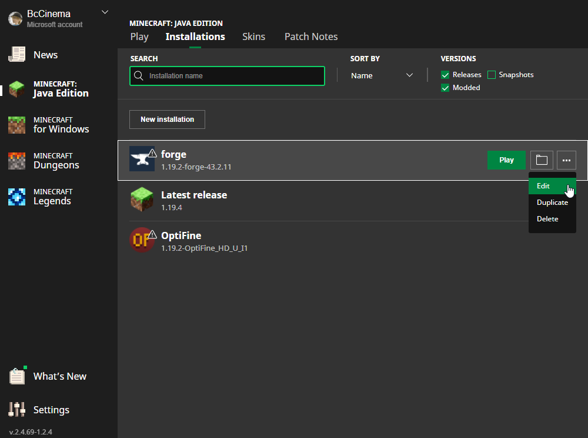

# Installation

## Forge

Double click the `forge-1.19.2-43.2.11-installer.jar`
- if your computer isn't sure how to run this, or it tries to open it like a folder, right click and then open with `Java(TM) Platform SE Binary`

You should see this window:

Ensure that `install client` is selected and press ok. **Do not** change the file location.

Once finished select ok.

Launch the minecraft launcher and you should see this option available:

Now select `Installations` at the top of the launcher. Select the three dots next to your forge installation and select edit:

Select `More Options v` towards the bottom.

Change `-Xmx2G` to `-Xmx4G` under `JVM Arguments`:
 -> 

Select `Save` and then press `Play` on your Forge installation
- Note that your first launch may take a minute to load the game

## Mods

Upon loading into the main menu, Select `mods`

Then Select `Open Mods Folder`

Move the `mods.zip` file into this window and unzip it 

- You may delete the `mods.zip` folder if you wish, but do not unzip any of the `.jar` files

Close and Relaunch the game and verify that you have `30` mods installed
- Note that it may take the game longer than normal to start with all of the mods

## Adding the Server

Select Multiplayer, Add a server.

The name can be whatever you want it to be

The server address will be ***pinned in discord*** 

# Mod Overview

## Optimization

### Clumps

Clumps changes the behavior of exp orbs, this is mainly for server performance

### Entity Culling

This allows entities (think chests and mobs), to not render if they are not in view of a player.

Keep in mind that if a player is in range the entity will still exist and behave as normal, It will just only load visually if it can be directly seen by a player

### LeavesBeGone

Greatly increases the rate at which leaves despawn after a tree is chopped down, all of the drops are the same as they would have been

### Optifine

Tons of client and server optimizations for lag/fps as well as allowing shaders and other cosmetic things

### Configured

Allows mod configuration for some mods in game instead of having to open the files

## UI

### JEI/JER (Just Enough Inventory/Resources)

When inside of your inventory there will be a pannel on the right where you can search for any item in the game. Clicking on an item will show you how to craft it or where to get it.

You can also bookmark items (default keybind is `a`)

`r` will also show you the recipe

`u` should show you what an item can be used in

Double-Clicking or `Crtl + f` will highlight the search bar

### JourneyMap

Gives a minimap and a fullscreen map. Allows for waypoints

`n` pulls up waypoints

`b` creates a waypoint at your location ***I highly recommend changing this keybind*** 

`j` opens the fullscreen map

[JourneyMap Wiki](https://teamjm.github.io/journeymap-docs/5.7.1/Client%20Docs/basic-usage/)

### StylishEffects

Better potion/status effect UI

### WTHIT (What the Hell is This)

Shows the name and mod of the block you are looking at

## Furniture

### Another Furniture Mod

adds lots of furniture like expanddable tables and couches
[Screenshots](https://www.curseforge.com/minecraft/mc-mods/another-furniture/screenshots)

### MrCrayfish's Furniture

adds tons of functional furniture, like fridges, grills, cabinets, blinds for windows

adds a mail system!
- make your own mail box and visit a post box to send items to people

[Screenshots](https://mrcrayfish.com/mods/cfm/screenshots)

### Macaw's Bridges, Fences & Walls, Lights, and Roofs

Tons of Bridges, new fences and walls, tons of lighting options, and roofing options

[Furniture](https://www.curseforge.com/minecraft/mc-mods/macaws-furniture)
[Bridges](https://www.curseforge.com/minecraft/mc-mods/macaws-bridges)
[Lights](https://www.curseforge.com/minecraft/mc-mods/macaws-lights-and-lamps)
[Roofs](https://www.curseforge.com/minecraft/mc-mods/macaws-roofs)
[Fences and Walls](https://www.curseforge.com/minecraft/mc-mods/macaws-fences-and-walls)

### Every Compat

This adds the wood colors from the other mods to all of the furniture (this is really fucking cool)

## World

### Oh the Biomes You'll Go

Adds a LARGE number of new biomes/trees/plants to all 3 dimensions

You start out with a Book (there is also a button in your inventory) that will teach you all about them

[Screenshots](https://www.curseforge.com/minecraft/mc-mods/oh-the-biomes-youll-go)

### Aquaculture 2

Adds tons of new fish, new fishing rods, bait, hooks, wall mounts and More

[Screenshots](https://github.com/TeamMetallurgy/Aquaculture/wiki)

## Items

### Backpacked

adds a wearable, customizable backpack. 

comes with its own enchantments and a shelf to display it on

[Screenshots](https://www.curseforge.com/minecraft/mc-mods/backpacked)

### EasyMagic

adds a reroll button to the enchanting table

[Forge Page](https://www.curseforge.com/minecraft/mc-mods/easy-magic)

### Explorer's Compass

adds a compass that can locate structures (temples, villages, etc)

### Nature's Compass

adds a compass that can locate specific biomes (including moded ones)
